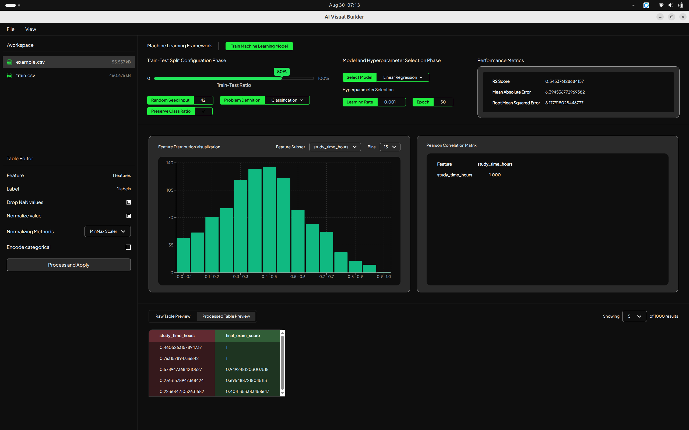

# Welcome Fellas

Welcome to the AI Visual Builder app. This open-source tool simplifies the development of Machine Learning, Deep Learning, and general AI applications. The project is currently in version 1.0.0 and actively welcoming improvements.

This project is open to everyone, and anyone can use it freely. We invite you to contribute and help us make a meaningful impact!

# App Overview

The app is divided into four main sections: the sidebar (which includes the Visual Studio Code-style Workspace Editor and Table Editor), the Data Preview (showing raw and processed tables), Statistics, and Training and Evaluation.

## The Sidebar Section

The sidebar contains the Workspace Editor and Table Editor. Like Visual Studio Code, the Workspace Editor allows users to open project directories. Currently, the app only supports CSV files, which are previewed in the raw data viewer where users can select feature and label columns. Multi-feature and multi-label selections are supported, though current modeling is limited to linear regression. In the Table Editor, users can preprocess the feature columns by enabling missing value removal (dropna), choosing a normalization method, and applying non-numeric data encoding (such as one-hot or ordinal encoding).

## Table Preview Section

This section previews the raw data selected in the Workspace Editor, as well as the processed data. Features selected by the user are highlighted in red, while selected labels are highlighted in green. Although the previews display only 5 to 20 rows, the total row count for each table is shown.

## Statistics Section

Currently, this section features interactive distributions and a Pearson correlation matrix for chosen features. Users can adjust histogram bin counts from 5 to 30 to help analyze key features and target labels prior to training.

## Train and Evaluation Section

This section enables users to train models and evaluate performance. Users can configure the train-test split ratio, set a random seed, define the Machine Learning task type (classification or regression), maintain class ratios (stratification), select a model, and tune hyperparameters. Once training is complete, the evaluation metrics are displayed: classification tasks show accuracy, precision, recall, and F1-score, while regression tasks display the relevant error metrics.

# Other Important Notes

The app uses an Electron framework with a React frontend and a Python backend. Contributions are welcome. Feel free to fork the project and open a pull request.

## How to Run This Project as Development?

1. Run `npm run dev`
2. Run `server.py` in backend directory
